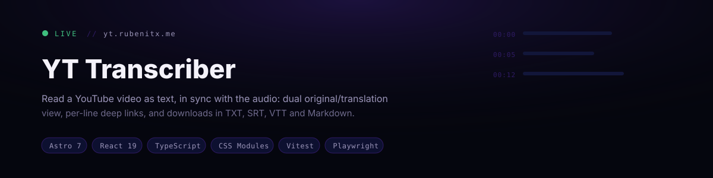
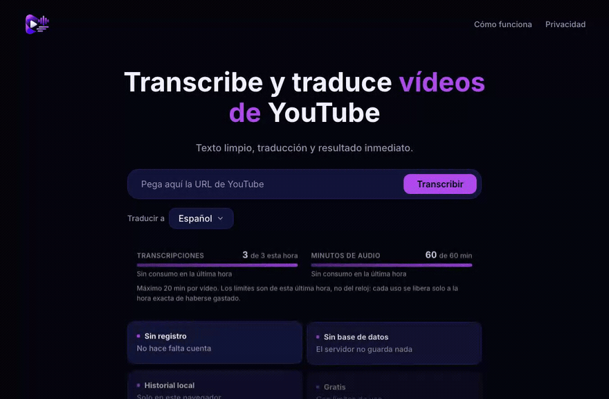
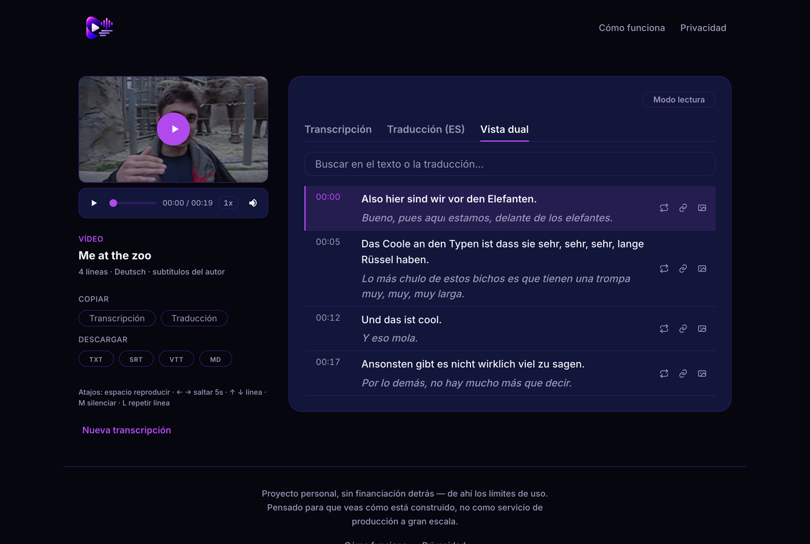

<div align="center">



[](https://github.com/rubenmtzb/yt-transcriber-web/actions/workflows/ci.yml)
[](https://astro.build)
[](https://react.dev)
[](https://www.typescriptlang.org)
[](LICENSE)

**[Try it live](https://yt.rubenitx.me)** · **[Backend repository](https://github.com/rubenmtzb/yt-transcriber-api)**

</div>

## What it does

Paste a YouTube URL, pick a language, and read the video as text while it plays. No account, no
signup, nothing stored on a server.



<sub>Recorded against <a href="https://yt.rubenitx.me">yt.rubenitx.me</a>. Not sped up.</sub>

### Dual view

Original and translation on the same line, so a reader can check the translation against what was
actually said.



## Features

- URL input with client-side validation and a target-language select.
- Live progress over SSE while the backend works, shown as a step-by-step checklist.
- Transcript, translation and dual-language tabs, with accent-insensitive search.
- Downloads in TXT, SRT, VTT and Markdown.
- Embedded player with custom controls. The line being spoken stays highlighted and in view, and
  clicking any line seeks the video to it.
- Per-line actions: loop it, copy a deep link to that moment
  (`?v=<id>&t=<seconds>&lang=<code>`), or export it as a quote-card image. The quote-card renderer
  loads only when requested, not on the initial page load.
- The line being read is found by binary search, so it lands on boundaries and during gaps without
  rescanning the transcript on every playback update.
- Keyboard shortcuts: space to play, arrows to seek and move between lines, `M` to mute, `L` to loop.
- Recent history in `localStorage`, so reopening a result costs nothing against the rate limit.
- English and Spanish, on real routes (`/` and `/es/`) rather than a client-side toggle.
- Responsive, with a reduced-motion path throughout.
- A Content-Security-Policy and the rest of the security headers shipped as [`public/_headers`](public/_headers), which Cloudflare Pages serves verbatim.

## How it fits with the backend

This repository is the frontend. It has no server-side logic: everything it shows comes from the
API's HTTP contract.

| | Repository | Runs on |
|---|---|---|
| **Web** | this one | Cloudflare Pages |
| **API** | [yt-transcriber-api](https://github.com/rubenmtzb/yt-transcriber-api) | Docker, home server |

One variable joins them, `PUBLIC_API_BASE_URL`. No shared code and no shared database, so pointing
this app at a locally running API is a one-line change.


## Getting started

```bash
npm install
npm run dev       # http://localhost:4321
npm run check     # type-check
npm run test      # unit + component tests
npm run build     # static output to dist/
```

You also need `yt-transcriber-api` running and reachable at `PUBLIC_API_BASE_URL`. Its README covers
that side.

### Docker

```bash
docker build -t yt-transcriber-web .
docker run -p 8080:80 yt-transcriber-web
```

## Configuration

Copy `.env.example` to `.env`:

| Variable | Default | Description |
|---|---|---|
| `PUBLIC_API_BASE_URL` | `http://localhost:8080` | Base URL of the backend |

Only `PUBLIC_`-prefixed variables reach the browser bundle (Astro/Vite convention). Never put a
secret behind that prefix.

> [!IMPORTANT]
> The API host is pinned in two places and both must agree: `PUBLIC_API_BASE_URL`, which the bundle
> inlines at build time, and the `connect-src` directive in [`public/_headers`](public/_headers).
> Change one without the other and the browser blocks every call while `curl` against the API keeps
> working, which makes the cause hard to see. After moving the backend, check the deployed response
> headers.

## Languages

English is the default and is served unprefixed; Spanish lives under `/es/`.

| | English | Spanish |
|---|---|---|
| Home | `/` | `/es/` |
| How it works | `/how-it-works/` | `/es/como-funciona/` |
| Privacy | `/privacy/` | `/es/privacidad/` |

Real routes rather than a toggle, because a toggle cannot give a screen reader a correct `lang`,
cannot be linked to, is invisible to a search index, and shows the wrong language until it
hydrates. `src/i18n/config.ts` holds the route table that the language switcher and the `hreflang`
tags both read, so neither can point at a page that does not exist; `src/i18n/ui.ts` holds every
string, with Spanish typed against the English key set so a missing translation is a build error.

## Project structure

```text
src/
  components/   React islands. TranscriptionApp drives the phases; UrlForm, ProcessingState,
                ErrorState, ResultView, VideoPlayer, SegmentList, the three viewers and
                RecentHistory hang off it. Header and Footer are static Astro partials.
                Styles sit next to each component as a *.module.css file.
  layouts/      BaseLayout.astro
  pages/        index, how-it-works, privacy, 404 — and es/ for the Spanish routes
  i18n/         config.ts (languages, route table), ui.ts (every string, both languages)
  services/     api.ts, the SSE client
  lib/          segments.ts (formatting, SRT/VTT/Markdown, search folding), history.ts,
                quoteCard.ts, share.ts. Each unit-tested on its own.
  types/        api.ts, mirroring the backend DTOs exactly
  styles/       global.css, design tokens and reset
public/         _headers (CSP and cache rules), _redirects, og.png (the social card),
                robots.txt, sitemap.xml
tests/          Vitest + Testing Library, mirroring src/
```

`TranscriptionApp` holds a single `phase` (`idle` → `processing` → `success` | `error`) plus the
history list and an optional deep-link prefill. Everything below it is driven by props, which keeps
the interactive surface testable without mounting the whole app.

## Deployment

Static build on Cloudflare Pages, deployed from `main` on every push, serving
<https://yt.rubenitx.me>.

## License

[MIT](LICENSE)
